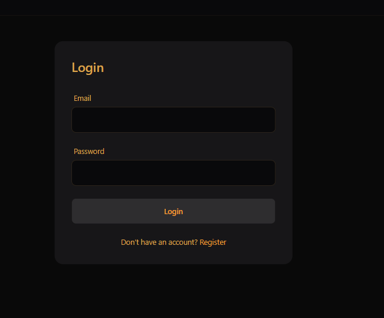
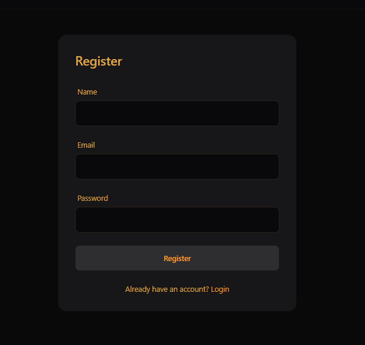
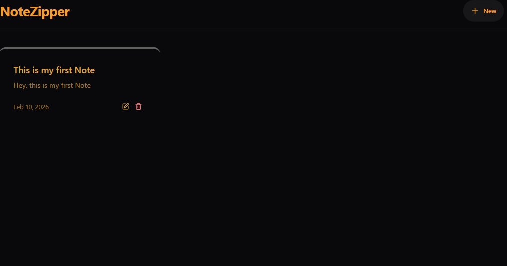
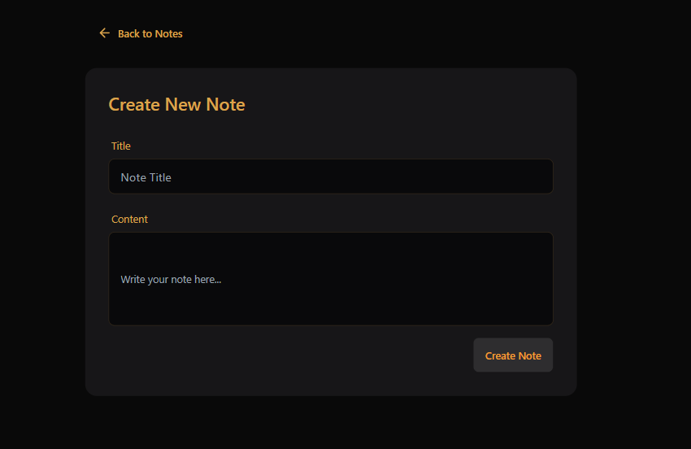
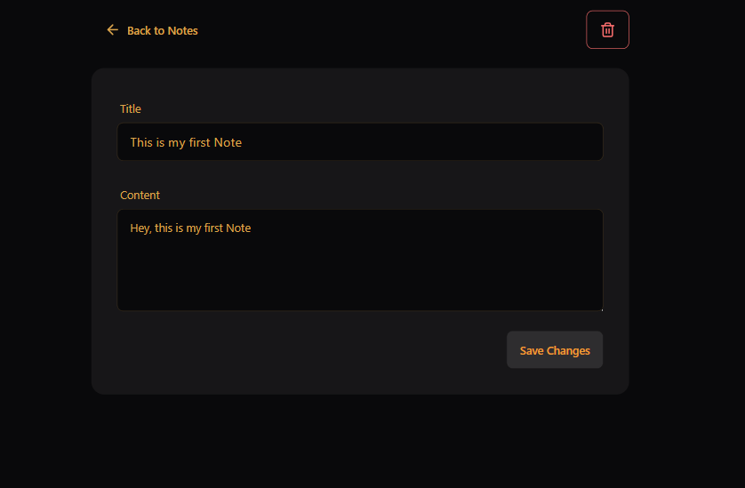

# 📝 NoteZipper

[](https://github.com/Harshitpant12/NoteZipper)
[](https://mongodb.com)
[](./LICENSE)

**NoteZipper** is a secure, full-stack notes management application built with the MERN stack (MongoDB, Express, React, Node.js). It features a robust authentication system, real-time UI updates, and a production-ready architecture designed for scalability.

---

## 🚀 Live Demo

[**View Live Application**](https://notezipper-g8e3.onrender.com)  
_(Note: The backend is hosted on a free tier, so the initial request may take 30-60 seconds to spin up.)_

---

## ✨ Key Features

- **🔐 Secure Authentication**: Full JWT-based auth system with HTTP-only cookie support (ready) and local storage failover.
- **🛡️ Protected Routes**: Custom middleware ensures user data privacy—users can only access their own notes.
- **⚡ Real-time Interface**: Instant feedback on CRUD operations using Optimistic UI principles.
- **🔍 Search & Filter**: Real-time filtering of notes by title and content.
- **🎨 Responsive Design**: Fully responsive UI built with **Tailwind CSS**.
- **📂 Clean Architecture**: Separation of concerns (Controllers, Routes, Models, Services) for maintainability.

---

## 🛠️ Tech Stack

### **Frontend**

- **React.js (Vite)**: Component-based UI library.
- **Tailwind CSS**: Utility-first CSS framework for rapid styling.
- **Context API**: Global state management for Authentication.
- **Axios**: HTTP client with interceptors for automatic token injection.
- **React Router 6**: Client-side routing with protected route wrappers.

### **Backend**

- **Node.js & Express.js**: RESTful API server.
- **MongoDB & Mongoose**: NoSQL database with strict schema validation.
- **JWT (JSON Web Tokens)**: Stateless authentication mechanism.
- **Bcrypt.js**: Industry-standard password hashing.
- **Express-Validator**: Middleware for server-side input sanitization.

---

## 📸 Screenshots

|                Login Page                 |                       Register                        |
| :---------------------------------------: | :---------------------------------------------------: |
|       |            |
|                Home Screen                |                       Dashboard                       |
|  |  |
|                Create Note                |                      Update Note                      |
|      |              |

---

## 🏗️ Architecture & Project Structure

The project follows a **MVC (Model-View-Controller)** pattern adapted for modern full-stack development.

```bash
NoteZipper/
├── backend/
│   ├── config/         # Database connection logic
│   ├── controllers/    # Request logic & business rules
│   ├── middleware/     # Auth checks & error handling
│   ├── models/         # Mongoose schemas (User, Note)
│   ├── routes/         # API endpoints definition
│   └── server.js       # App entry point
└── frontend/
    ├── src/
    │   ├── components/ # Reusable UI components
    │   ├── context/    # Global Auth State
    │   ├── lib/        # Axios configuration
    │   ├── pages/      # View pages (Login, Home)
    │   └── App.jsx     # Main routing logic

```


## ⚙️ Installation & Setup

Follow these steps to run the project locally.

### Prerequisites
- **Node.js** (v14+)
- **MongoDB** (Local instance or MongoDB Atlas URL)
- **Git**

### 1. Clone the Repository
```bash
git clone [https://github.com/Harshitpant12/NoteZipper.git](https://github.com/Harshitpant12/NoteZipper.git)
cd NoteZipper
```

### 2. Backend Setup
Navigate to the backend folder and install dependencies:
```bash
cd backend
npm install
```

Create a `.env` file in the `backend/` root folder with the following variables:
```env
PORT=5000
MONGO_URI=your_mongodb_connection_string
JWT_SECRET=your_super_secret_random_key
NODE_ENV=development
```

Start the backend server:
```bash
npm run dev
```
*The server should run on http://localhost:5000*

### 3. Frontend Setup
Open a new terminal window, navigate to the frontend folder, and install dependencies:
```bash
cd ../frontend
npm install
```

Start the React development server:
```bash
npm run dev
```
*The app should now be live on http://localhost:5173*

---

## 🔌 API Reference

| Method | Endpoint | Description | Protected? |
| :--- | :--- | :--- | :---: |
| **POST** | `/api/auth/register` | Register a new user | ❌ |
| **POST** | `/api/auth/login` | Authenticate user & get token | ❌ |
| **GET** | `/api/notes` | Get all notes for the logged-in user | ✅ |
| **POST** | `/api/notes` | Create a new note | ✅ |
| **PUT** | `/api/notes/:id` | Update a specific note | ✅ |
| **DELETE** | `/api/notes/:id` | Delete a specific note | ✅ |

---

## 📈 Scalability & Production Readiness

This application is designed with a monolithic architecture for simplicity but is structured to scale into a microservices ecosystem as traffic grows.

1.  **Horizontal Scaling**: The stateless nature of JWT authentication allows us to deploy multiple instances of the backend behind a Load Balancer (e.g., Nginx) without session affinity issues.
2.  **Database Optimization**: Mongoose schemas are indexed on `user` and `createdAt` fields to ensure O(log n) query performance even with millions of records.
3.  **Security Hardening**:
    * **Rate Limiting**: Implemented to prevent brute-force attacks on API endpoints.
    * **Input Validation**: `express-validator` sanitizes all incoming data to prevent NoSQL injection.
    * **Environment Isolation**: Strict separation of Development and Production environments via `.env`.
4.  **CI/CD Pipeline**: The project is deployed via Render with auto-deploy hooks, ensuring that the production branch is always up-to-date with the latest stable code.

---

## 🤝 Contributing

Contributions are welcome!

1.  **Fork** the project.
2.  Create your **Feature Branch** (`git checkout -b feature/AmazingFeature`).
3.  **Commit** your changes (`git commit -m 'Add some AmazingFeature'`).
4.  **Push** to the Branch (`git push origin feature/AmazingFeature`).
5.  Open a **Pull Request**.

---

## 📄 License

Distributed under the **MIT License**. See `LICENSE` for more information.
